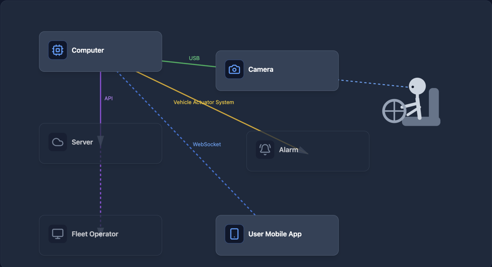
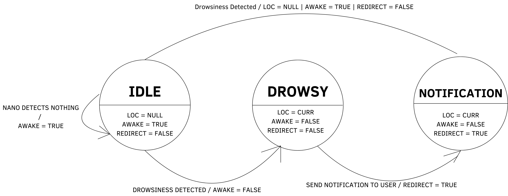

<div align="center">

# Driver Drowsiness Detection


### Group 7

* **Pranav Jha** 
* **Alejandro Melo-Elizalde** 
* **Jason Waseq**
* **Pravin Agrawal-Chung** 
* **Ricardo Diaz Fuentes** 
* **Soham Jain**

</div>

\newpage

## Table of Contents
1. Title Page
2. Table of Contents
3. Introduction
    * 3.1. Need & Goal Statements
4. Personas
    * 4.1. Truck Driver Persona (Mike Dunford)
    * 4.2. Fleet Operator Persona (Sarah Porter)
5. Existing Designs & Products Research
6. Sustainability Statement
7. Design Features
    * 7.1. Driver Monitoring Features
    * 7.2. Alert and Safety Features
    * 7.3. Mobile App Features
    * 7.4. Fleet Management Features
    * 7.5. System Architecture
8. Block Diagrams
9. State Transition Diagrams
10. Technology
11. Functional Prototype
12. Testing
    * 12.1. Testing Scenarios

\newpage

## Introduction

Driver drowsiness is a safety-critical problem, as it causes unsafe driving conditions by lowering reaction times, reducing attention, and impairing decision-making. 

* **The Impact:** An estimated **17.6% of fatal crashes** in the United States from 2017 to 2021 involved a drowsy or tired driver, resulting in approximately **30,000 deaths** during that period. 
* **Our Solution:** We are building a proactive system designed to reduce fatigue-related accidents. 
* **How it Works:** The system captures visual data of the driver and makes real-time inferences based on their body language. This keeps the driver in check, ensuring they are neither tired nor drowsy during their trip, which ultimately reduces mistakes.
* **Safety Precaution:** Fleet operators are integrated into the system as an extra layer of precaution. If a driver is drowsy and fails to stop and rest, the fleet operator will intervene and remind the driver to pull over, preventing accidents and keeping the roads safe.

---

## Need & Goal Statements

**Need Statement**: 
Vehicular accidents are caused by people feeling too drowsy/tired.

**Goal Statement**: 
Prevent people from driving while drowsy.

---

## Technology

*(Note: Content formatted into categories for easier reading)*

**Hardware & Processing**

* **Custom PCB:** The "brain" of the device acts as the central computer.
* **GPU:** The PCB is equipped with a powerful GPU capable of hosting and running our real-time AI model.

**Block Diagram**:



**Software & Artificial Intelligence**

* **AI Model:** Programmed using the **Python** programming language.
* **Framework:** Utilizes **Mediapipe** for visual data processing and body language inferences.

**Frontend & Notifications**

* **User Interface:** Notifications are pushed to a frontend application that operates seamlessly across **Android**, **iOS**, and the **Web**.
* **Development Framework:** The app is built using **Flutter**, which utilizes the **Dart** programming language.
* **Dependencies:** Compiling the app requires the **Android SDK** (for Android devices) and **XCode** (for iOS devices).

**State Machine**:




# Personas

### 1. Truck Driver Persona

**Name:** Mike Dunford  
**Age:** 42  
**Role:** Long-haul truck driver  
**Experience:** 15 years of commercial driving  
**Tech Comfort:** Moderate  
**Primary Goal:** Stay safe on long routes, avoid accidents, and keep his job performance strong.  

**Background**  
Mike drives long interstate routes, often overnight or for extended hours. Fatigue, highway monotony, and pressure to meet delivery schedules are part of his daily routine. He wants tools that help him stay alert, but he does not want to feel constantly punished or micromanaged.

**Needs**
* Real-time alerts when signs of drowsiness or distraction are detected
* Alerts that are accurate and not overly sensitive
* A system that helps prevent accidents before they happen
* A simple mobile app that clearly explains what happened and what action to take
* Confidence that the system is protecting him, not just monitoring him

**Pain Points**
* False alarms that go off when he is just checking mirrors or glancing at controls
* Feeling like management is watching every move
* Stress from long shifts and strict delivery deadlines
* Concern that a single alert could be used unfairly against him

**Motivations**
* Wants to get home safely
* Wants to maintain a good driving record
* Wants proof that he is a responsible driver
* Appreciates technology that supports him without being intrusive

**How He Uses the System**
* Camera monitors eye closure, head position, and attention level
* Embedded AI system detects risky behavior such as microsleep, prolonged distraction, or head droop
* Driver app sends immediate alerts like vibration, sound, or message prompts
* He may receive suggestions such as “Take a break” or “Eyes on road”

**What Success Looks Like for Mike**
* Fewer fatigue-related incidents
* Helpful alerts that feel like a safety assistant
* Fair reporting to the fleet operator
* Less risk of accidents, violations, and job-related stress

### 2. Fleet Operator Persona

**Name:** Sarah Porter  
**Age:** 38  
**Role:** Fleet operations manager  
**Experience:** 10 years in logistics and fleet safety  
**Tech Comfort:** High  
**Primary Goal:** Improve fleet safety, reduce liability, and keep operations efficient.  

**Background**  
Sarah oversees dozens or hundreds of vehicles and drivers. She is responsible for safety compliance, reducing accident costs, minimizing downtime, and protecting the company’s reputation. She needs visibility into driver risk without manually reviewing every trip.

**Needs**

* Centralized dashboard or app notifications for serious safety events
* Clear reporting on drowsiness, distraction, and repeated unsafe behavior
* Actionable insights rather than raw video alone
* Driver trend analysis over time
* Evidence that helps with coaching, compliance, and insurance discussions

**Pain Points**

* Limited visibility into what happens on the road in real time
* High cost of accidents, claims, and vehicle downtime
* Difficulty identifying risky driver patterns before an incident occurs
* Too many alerts can overwhelm operations teams
* Need to balance driver privacy with company safety goals

**Motivations**

* Reduce accident frequency and severity
* Protect drivers and company assets
* Improve insurance outcomes and compliance posture
* Coach drivers using objective data
* Run a safer and more efficient fleet

**How She Uses the System**

* Receives app or dashboard alerts when risky driver behavior crosses a threshold
* Reviews event summaries such as sleeping, head inattention, phone distraction, or repeated unsafe patterns
* Uses reports to identify drivers who need coaching or schedule adjustments
* Tracks safety trends across vehicles, routes, and shifts

**What Success Looks Like for Sarah**

* Fewer accidents and insurance claims
* Better safety KPIs across the fleet
* Faster intervention when a driver is at risk
* Reliable data that supports training and accountability
* A scalable system that does not require constant manual monitoring

\newpage

# Design Objectives

The driver drowsiness detection system should meet several design objectives to ensure that it is practical, effective, and usable in real-world driving environments.

| Objective | Description |
|-----------|-------------|
| Mobility | The system should be portable and able to operate in different vehicles without requiring permanent installation. Users should be able to easily set up and move the system between vehicles. |
| Accuracy | The system should reliably detect genuine signs of drowsiness while minimizing false positives such as normal head movement or mirror checks. |
| Ease of Use | The setup and daily use of the system should be simple for drivers, requiring minimal configuration or technical knowledge. |
| Low Latency Alerts | Alerts must occur quickly after detecting dangerous fatigue behavior so the driver has time to respond. |
| Reliability | The system should continue functioning under different lighting conditions, driver positions, and long operating times. |
| Offline Capability | The system should still detect drowsiness and issue alerts even if network connectivity is unavailable for the driver. 

<div style="page-break-after: always;"></div>


<!-- TODO: Sustainability Statement — file not found: userdocs/Sustainability_Statement.md -->

## 7. Design Features

### 7.1. Driver Monitoring Features
* **Real-time driver face detection:** The system continuously detects and tracks the driver’s face using a camera mounted on the windshield.
* **Eye closure detection:** The AI model monitors eye closure duration to identify signs of fatigue or microsleep.
* **Blink rate analysis:** Abnormally slow or irregular blinking patterns are used as indicators of drowsiness.
* **Head position monitoring:** The system detects head drooping or nodding, which commonly occurs when a driver begins falling asleep.
* **Driver attention tracking:** The model determines whether the driver is looking forward at the road or looking away for extended periods of time.

### 7.2. Alert and Safety Features
* **Real-time driver alert:** Audible alarms or phone notifications are triggered when unsafe behavior is detected. 
* **Tiered alert system:** The system provides multiple alert levels, starting with early warnings and escalating to stronger alerts if fatigue worsens.
* **Driver break recommendations:** When fatigue indicators persist, the system suggests that the driver pull over and take a rest break.
* **Driver not visible detection:** If the driver leaves the camera’s field of view, the system alerts the user that monitoring cannot continue.
* **Camera misalignment detection:** The system detects if the camera has moved or is no longer pointed correctly and requests recalibration.

### 7.3. Mobile App Features
* **Cross-platform mobile application:** A Flutter-based mobile app allows the system to run on Android, iOS, and web platforms.
* **Real-time push notifications:** Alerts are sent directly to the driver’s phone when unsafe behavior is detected.
* **Driver status display:** The mobile app shows the current monitoring state, such as alert, warning, or normal.
* **Driver Connectivity Monitoring:** The app warns users when the mobile device loses connection with the monitoring hardware.
* **GPS Routing System:** The app allows the user to find nearby rest stops, gas stations, cafes, etc., with direct links to Google Maps or Apple Maps. Additionally, it previews the route for the driver to see which is the best one to take.

### 7.4. Fleet Management Features
* **Fleet Operator Dashboard:** Fleet managers can monitor safety alerts and driver behavior across multiple vehicles.
* **Driver risk event reporting:** The system logs events such as drowsiness alerts, distractions, and monitoring failures.
* **Driver safety trend analysis:** Historical data can be analyzed to identify drivers who frequently experience fatigue.
* **Remote safety notifications:** Fleet operators receive alerts when high-risk behavior is detected.

### 7.5. System Architecture
* **On-device AI processing:** The driver monitoring model runs locally on the device, reducing latency and cloud dependency.
* **Offline operation capability:** The system continues monitoring and generating alerts even when internet connectivity is unavailable.
* **Custom PCB integration:** A custom printed circuit board hosts the system components and manages communication between hardware modules.


<div style="page-break-after: always;"></div>


# Testing Scenarios

The following tests verify that the driver monitoring system behaves correctly under various conditions. Each test defines what should happen and when it should occur.

| Test Case | When It Happens | Expected Behavior |
|-----------|----------------|------------------|
| User Not Visible | The driver moves out of the camera’s field of view or their face cannot be detected with the camera. | The system detects that the driver is no longer visible and issues a warning such as "Driver not detected." The model needs to detect correctly and the phone needs to give a notification. |
| Camera Moved or Misaligned | The camera position or angle changes and the driver's face can no longer be properly tracked. | The system prompts the user to adjust or recalibrate the camera before monitoring resumes. |
| Not Connected to Jetson | The mobile app attempts to communicate with the Jetson device but the connection fails. | The app displays a "Device Not Connected" warning and prevents monitoring from starting until the connection is restored. |
| Calibration Not Completed | A new user starts the system or calibration data is missing. | The system requires the user to complete the calibration process before monitoring begins. |
| Driver About to Fall or Completely Asleep | The AI detects prolonged eye closure, head drooping, or other indicators that the driver is asleep. | A high-priority alert such as a loud sound or vibration is triggered. The driver is prompted to wake up or pull over. |
| Driver Slight Drowsy | Early fatigue indicators such as slow blinking, long eye closure, or head nodding are detected. | The system sends a warning alert encouraging the driver to stay attentive or take a break. |
| App Works Without Network | The system loses internet connectivity while monitoring is active. | Real-time driver monitoring and alerts continue locally. Data may be stored and synced when connectivity returns. |
| Spoofing with Incorrect Camera Feed | An incorrect or external video source is connected instead of the intended driver camera. | The system detects the invalid feed and disables monitoring until a verified camera input is restored. |

<div style="page-break-after: always;"></div>

<!-- TODO: Need & Goal Statement (standalone) — file not found: userdocs/Need_and_Goal_Statement.md -->

# Appendix 1 — Problem Formulation

---

## 1.1 Conceptualisations

### Initial Concept

The core idea is a compact, vehicle-mounted device that uses a camera to continuously monitor the driver's face. When signs of drowsiness are detected (prolonged eye closure, high blink rate), the system immediately alerts the driver through their smartphone. The system must operate with minimal latency.

### Key Constraints Identified Early

- **Real-time performance:** Detection-to-alert latency must be low enough that the driver is warned before a dangerous situation develops.
- **Edge inference:** Processing must happen locally on the device to avoid dependency on cellular connectivity.
- **Lighting variability:** The system must function at night and in low-light conditions, requiring built-in IR camera support.
- **Non-intrusive:** The system should not distract the driver or require interaction while driving.
- **Cross-platform mobile app:** The alert interface must work on both iOS and Android.
- **Cost:** The total hardware cost should remain feasible for consumer or fleet deployment.

---

## 1.2 Brainstorming

The team conducted brainstorming sessions to explore the design space across four major dimensions: hardware platform, ML approach, communication protocol, and mobile app framework. The following captures the ideas generated in each area.

### Hardware Platform Options

| Option | Pros | Cons |
|--------|------|------|
| **NVIDIA Jetson Orin Nano** | 20–40 TOPS, TensorRT optimization, GPU-accelerated inference, mature JetPack SDK | Higher power draw (~7–15W), larger form factor, higher cost (~$200–$500) |
| **Raspberry Pi 5** | Low cost (~$80), large community, compact | No GPU acceleration for DNN inference, limited to CPU/TPU add-ons, slower inference |
| **ESP32 + external camera** | Ultra-low cost, ultra-low power | Insufficient compute for real-time DNN inference, not viable for this application |
| **Smartphone-only (no external hardware)** | Zero additional hardware | Battery drain, camera positioning challenges, limited ML performance, thermal throttling |

### ML Model / Framework Options

| Option | Pros | Cons |
|--------|------|------|
| **MediaPipe Face Mesh** | Lightweight, well-documented, 468 facial landmarks | Less accurate for extreme head poses, may need supplementary model for yawning |
| **Custom CNN (eye state classifier)** | Can be trained on domain-specific data, potentially highest accuracy | Requires labeled training data, longer development time |
| **YOLO-Face + landmark regression** | Single-shot detection, fast, GPU-friendly | Heavier model, may be overkill for single-face in-cabin use |
| **DeepStream pipeline (NVIDIA)** | Optimized for Jetson, handles video decode + inference pipeline | Steeper learning curve, vendor lock-in |

### Communication Protocol Options

| Option | Pros | Cons |
|--------|------|------|
| **MQTT + WebSocket gateway** | Lightweight pub/sub, decoupled architecture, persistent backend storage, scalable | Requires backend infrastructure, more complex setup |
| **Direct WebSocket (Jetson → phone)** | Simple, low latency, bidirectional | Requires Jetson hotspot or shared network, no data persistence |
| **BLE (Bluetooth Low Energy)** | No network needed, auto-pairs, very low power | Limited bandwidth, shorter range, no data persistence |

### Mobile App Framework Options

| Option | Pros | Cons |
|--------|------|------|
| **Flutter** | Single codebase for iOS + Android, rich UI toolkit, Dart is easy to pick up, strong community | Larger app binary, Dart ecosystem smaller than JS |
| **React Native** | Large community, JavaScript-based, many libraries | Performance overhead via JS bridge, inconsistent native module support |
| **Native (Swift + Kotlin)** | Best performance, full platform API access | Two separate codebases, doubles development effort |

---

## 1.3 Decision Tables

The team used weighted decision matrices to evaluate alternatives across the four major design dimensions. Criteria were weighted based on project priorities (safety-critical real-time performance, development feasibility within two quarters, and cost).

### Decision Table 1: Hardware Platform

| Criteria (weight) | Jetson Orin Nano | RPi 5 | ESP32 |
|--------------------|:---:|:---:|:---:|
| **ML inference speed (0.30)** | 5 | 2 | 1 |
| **Power efficiency (0.10)** | 3 | 4 | 5 |
| **Cost (0.15)** | 2 | 4 | 5 |
| **SDK / tooling (0.20)** | 5 | 4 | 2 |
| **Camera/sensor support (0.15)** | 5 | 4 | 2 |
| **Community / documentation (0.10)** | 4 | 5 | 4 |
| **Weighted Total** | **4.15** | **3.40** | **2.45** |

**Decision:** Jetson Orin Nano — the GPU-accelerated inference and TensorRT support are critical for achieving real-time performance on a DNN-based detection pipeline.

### Decision Table 2: Communication Protocol

| Criteria (weight) | MQTT + WS Gateway | Direct WebSocket | BLE |
|--------------------|:---:|:---:|:---:|
| **Latency (0.25)** | 4 | 5 | 4 |
| **Reliability (0.25)** | 5 | 3 | 3 |
| **Data persistence (0.15)** | 5 | 1 | 1 |
| **Offline capability (0.15)** | 4 | 4 | 5 |
| **Implementation complexity (0.10)** | 2 | 4 | 3 |
| **Scalability (0.10)** | 5 | 2 | 2 |
| **Weighted Total** | **4.15** | **3.30** | **3.10** |

**Decision:** MQTT uplink + backend consumers + Postgres + WebSocket gateway downlink. This architecture provides the best balance of reliability, data persistence, and real-time alert delivery. The Jetson publishes telemetry and alerts to an MQTT broker. Backend consumer services subscribe to those messages, process them, and store results in Postgres. The Flutter app connects to a WebSocket gateway that reads the latest updates from the backend and pushes them to users in real time. The system is hosted on a static IP behind a domain.

### Decision Table 3: Mobile App Framework

| Criteria (weight) | Flutter | React Native | Native (Swift+Kotlin) |
|--------------------|:---:|:---:|:---:|
| **Cross-platform from single codebase (0.30)** | 5 | 4 | 1 |
| **Development speed (0.25)** | 5 | 4 | 2 |
| **Performance (0.15)** | 4 | 3 | 5 |
| **Team familiarity (0.20)** | 4 | 3 | 2 |
| **Library ecosystem for BLE/WS (0.10)** | 4 | 4 | 5 |
| **Weighted Total** | **4.55** | **3.65** | **2.40** |

**Decision:** Flutter — delivers cross-platform support from a single Dart codebase with strong WebSocket and notification libraries.

### Decision Table 4: ML Model / Framework

| Criteria (weight) | MediaPipe + EAR | Custom CNN | YOLO-Face |
|--------------------|:---:|:---:|:---:|
| **Inference speed (0.30)** | 4 | 4 | 3 |
| **Accuracy (0.25)** | 4 | 3 | 3 |
| **Integration with Jetson (0.20)** | 4 | 3 | 4 |
| **Development effort (0.15)** | 4 | 1 | 4 |
| **Documentation (0.10)** | 5 | 1 | 4 |
| **Weighted Total** | 4.10 | 2.80 | 3.45 |

**Decision:** MediaPipe Face Mesh with EAR (Eye Aspect Ratio) calculation - provides reliable, real-time detection of eye closure with minimal computational overhead, making it well-suited for edge deployment.

---

## 1.4 Morphological Chart

The morphological chart below maps each functional requirement of the system to the design alternatives considered, with the **selected option highlighted in bold**.

| Function | Option A | Option B | Option C | Option D |
|----------|----------|----------|----------|----------|
| **Compute platform** | **Jetson Orin Nano** | Raspberry Pi 5 | RPi + Coral TPU | ESP32 |
| **Camera type** | USB webcam (visible light) | **IR camera (night-capable)** | Stereo depth camera | Smartphone camera |
| **Face detection** | MediaPipe Face Detector | dlib HOG detector | YOLO-Face | Haar Cascades |
| **Drowsiness metric** | **EAR (Eye Aspect Ratio)** | PERCLOS | Head pose estimation | Blink frequency |
| **Fatigue classification** | Threshold-based (EAR < value) | **Temporal analysis (EAR over sliding window)** | CNN binary classifier | Hybrid (threshold + CNN) |
| **Jetson → backend comm** | **MQTT publish** | HTTP POST | Direct WebSocket | BLE |
| **Backend storage** | **PostgreSQL** | MongoDB | SQLite | Firebase Realtime DB |
| **Backend → app comm** | **WebSocket gateway** | FCM push | Polling (HTTP) | Server-Sent Events |
| **Mobile framework** | **Flutter** | React Native | Native iOS + Android | Kotlin Multiplatform |
| **Alert modality** | Visual popup only | **Audio alarm + vibration + visual** | Haptic wearable | Seat vibration motor |
| **Power source** | **Vehicle 12V (via adapter)** | USB battery bank | Hardwired to OBD-II | Solar + battery |
| **Mounting** | Dashboard mount | **Visor/mirror mount** | A-pillar clip | Rearview mirror replacement |


The selected path through the morphological chart (bold entries) represents the team's final design: a Jetson Orin Nano with an IR camera performing EAR-based drowsiness detection over a sliding temporal window, communicating alerts via MQTT to a backend that persists data in Postgres and pushes real-time alerts through a WebSocket gateway to a cross-platform Flutter app that uses audio, vibration, and visual alerts to wake the driver.

# Appendix 2 — Planning

---

## 2.1 Basic Plan / Gantt Chart

The project spans two academic quarters at UC Santa Cruz: Winter 2026 (January–March) and Spring 2026 (April–June). The plan is divided into four major phases: Research & Definition, Design & Architecture, Implementation & Prototyping, and Testing & Documentation.

### Project Timeline (Text-Based Gantt Chart)

```
Phase / Task                        Jan    Feb    Mar    Apr    May    Jun
                                   W1-W4  W5-W8  W9-W12 W13-16 W17-20 W21-24
─────────────────────────────────────────────────────────────────────────────
PHASE 1: Research & Definition
  Problem formulation                ████
  Brainstorming & concept gen        ████
  Existing product research            █████
  Persona development                     ██
  Need & goal statements              █████

PHASE 2: Design & Architecture
  System architecture design            ██████
  Communication protocol design             ██████
  ML pipeline design                    ██████
  Design document (initial draft)               ████
  Mobile app UI mockup                  ██
  Hardware procurement                 ██ 

PHASE 3: Implementation & Prototyping
  ML model integration & tuning          ███████████
  Backend setup (MQTT broker, DB,            ██████████
    fleet operator WebSocket)
  Flutter app development                  █████████   █████
  External alarm integration                           ██████
  Hardware mounting / enclosure                            ██████
  System integration                             ███   █████

PHASE 4: Testing & Documentation
  Unit testing (per subsystem)                         █████
  Integration testing                                      ██████
  Design document (final)                                    ██████
  Final presentation prep                                        ████

```
<!-- PLACEHOLDER: Imaybe include screenshot from Teamwork for how we split tasks -->

---

## 2.2 Division of Labor During Prototyping Phase

The team of six divided responsibilities based on individual expertise and interest areas. The table below shows the primary ownership of each subsystem during the prototyping phase, along with secondary contributors.

| Subsystem | Primary Owner(s) | Description |
|-----------|------------------|-------------|
| **ML Pipeline** | Jason, Soham | Face detection model selection, EAR computation, head pose estimation, camera integration, sliding window fatigue classification |
| **SoC → Phone Communication (BLE)** | Jason, Soham | BLE service/characteristic setup on SoC, drowsiness event packet format, connection management |
| **SoC → Backend Communication (MQTT)** | Jason, Soham | MQTT client on SoC, broker setup, event topic/payload design, WiFi connectivity |
| **SoC → External Alarm (Wired)** | Ricardo, Pravin | GPIO-driven alarm trigger, wired buzzer/speaker integration, signal timing |
| **Backend & Fleet Operator Interface** | Jason, Soham | MQTT event consumer, PostgreSQL schema design, WebSocket gateway for fleet operator notification |
| **Flutter Mobile App** | Pranav, Pravin, Alejandro, Ricardo | UI/UX design, BLE client, alert display (audio/vibration/visual), rerouting suggestions, connection status |
| **Hardware & Enclosure** | Alejandro, Pranav | Device mounting, IR camera selection and positioning, power supply (12V vehicle adapter), physical enclosure/housing, external alarm mounting |
| **Documentation & Testing — ML Pipeline & Integration** | Jason, Soham | Design document coordination, appendices (problem formulation, planning), test plan development, integration testing across all three alert paths |
| **Documentation & Testing — Mobile App** | Pranav, Pravin, Alejandro, Ricardo | Design document coordination, appendices (problem formulation, planning), test plan development |


## 2.3 Collaboration

### Repository Structure

The team uses a shared GitHub repository as the single source of truth for all project code and documentation. 

### Branching Strategy

The team follows a feature-branch workflow:

1. Each team member creates a feature branch from `main` for their work (e.g., `feature/mqtt-broker`, `feature/flutter-alerts`, `feature/ble-service`, `feature/external-alarm`).
2. When a feature is complete, the member opens a Pull Request (PR) for code review.
3. At least one other team member reviews the PR before merging into `main`.
4. Team members regularly pull from `main` into their feature branches to stay in sync and reduce merge conflicts.

### Task Management with Teamwork

Beyond the Git repository, the team uses **Teamwork** as the primary project management tool. Teamwork is used for:

- **Task assignment:** Each task is assigned to a team member with a due date. Tasks correspond to the subsystems in the division of labor table above.
- **Milestone tracking:** Key milestones from the Gantt chart are tracked as Teamwork milestones, allowing the team to monitor progress at a glance.
- **Task lists and subtasks:** Larger deliverables (e.g., "Flutter app development") are broken into subtasks (e.g., "Implement BLE client," "Design alert UI," "Add vibration/audio alerts," "Implement rerouting suggestions") and tracked individually.

### Communication

- **Regular meetings:** The team meets twice a week to discuss progress, blockers, and upcoming tasks. Meeting notes are shared in a Google Doc
- **Asynchronous communication:** Day-to-day questions and quick updates are handled via Discord
- **Design reviews:** Major design decisions (such as the communication protocol selection documented in Appendix 1) are discussed as a full team before implementation begins.

### Tools Summary

| Tool | Purpose |
|------|---------|
| **GitHub** | Version control, code review (PRs), documentation hosting |
| **Teamwork** | Task assignment, milestone tracking, project timeline |
| **Discord**  | Real-time communication |
| **Google Docs** | Meeting notes, shared drafts |
| **Figma** | Design schematic |


<!-- TODO: Appendix 3 — Test Plan & Results — file not found: appendices/Appendix_3_Test_Plan_Results.md -->

<!-- TODO: Appendix 4 — Review — file not found: appendices/Appendix_4_Review.md -->

